# IBM Tech Seller OIDC Demo

# Table of Contents
<!-- TOC -->

- [Table of Contents](#table-of-contents)
- [Introduction](#introduction)
    - [Sample SAML application](#sample-saml-application)
    - [Getting started](#getting-started)
        - [Pre-requisites](#pre-requisites)
- [Application setup](#application-setup)
    - [Perform setup](#perform-setup)
    - [Install packages](#install-packages)
    - [Start the application](#start-the-application)
    - [Create an application in Cloud Identity](#create-an-application-in-cloud-identity)
    - [Login now](#login-now)
    - [View profile](#view-profile)

<!-- /TOC -->

CERTS EXPIRE ON 17 JUNE 2025!!!

# Introduction

## Sample OIDC application

This application can be used for development or demonstration purposes focusing on SSO with an OIDC connector. It is best used with a simple redirect from a client's public facing webpage. (Read below for how to set one up) 

When a login attempt is successful, you will be able to view all attributes that were received for the user and explain how the information could be used to manage the user. Additionally, we provide the raw JSON return from the application for more advanced debugging. 

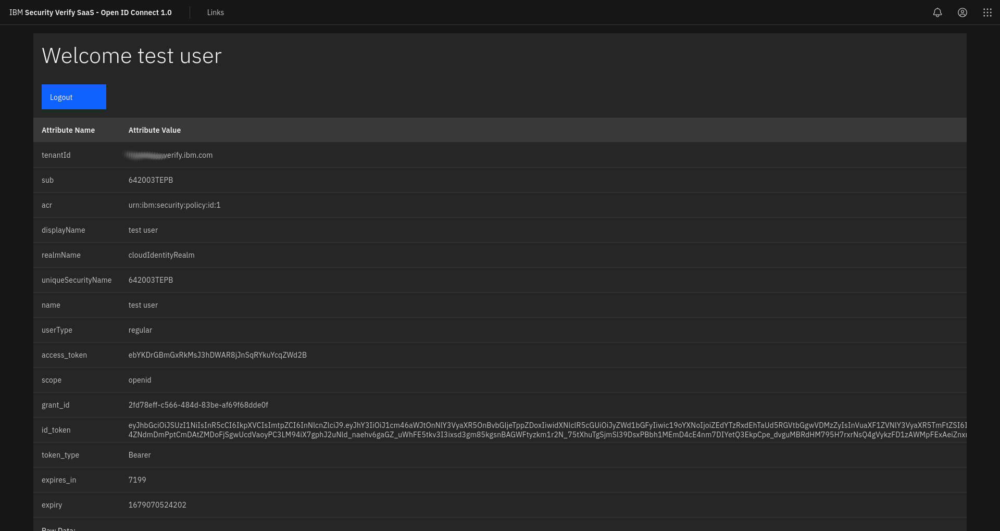

## Getting started

You will need to do a little configuration of the application before beginning. Take a look at the .env file to the server directory. You can copy the following and paste it in there if it isn't already. Keep this location in mind because after creating the custom app, you will need to put the information in here.
```
TENANT_URL=[YOUR URL HERE] 
CLIENT_ID=[YOUR CLIENT ID HERE]
CLIENT_SECRET=[YOUR CLIENT SECRET HERE]
APP_URL=https://localhost:3000
RESPONSE_TYPE=code
FLOW_TYPE=authorization
SCOPE=openid
SESSION_SECRET=somethinghardtoguess
HTTPS=true
SSL_CRT_FILE=./cert.pem 
SSL_KEY_FILE=./key.pem
PORT=3000
```

### Pre-requisites

1. You will need an IBM Security Cloud Identity tenant
2. To run locally, you will need to install [NodeJS](https://nodejs.org/en/download/) if you don't already have it.
3. It's import to clone this repo to keep it in sync, otherwise you can simply download the zip file from GitHub.

# Application setup

## Perform setup

In the directory where you want the repo clone directory to be created, run this command:

```
git clone https://github.com/arocklife1/IBM-Tech-CIAM-Demo
```

## Install packages

Go into the "after-login" directory and install required packages:

```js
cd ../after-login
npm install
```

**Note:** This may take a while to complete

## Start the application

Start the application by running the command in the after-login directory: 

If using NPM:
```js
npm start
```

If using yarn:
```js
yarn start
```

Navigate to the client's webpage to begin

**Note** Alternately, you can simply go to https://localhost:3000 to begin the workflow.

## Create an application in Cloud Identity

First, go to your Verify Tenant and login.

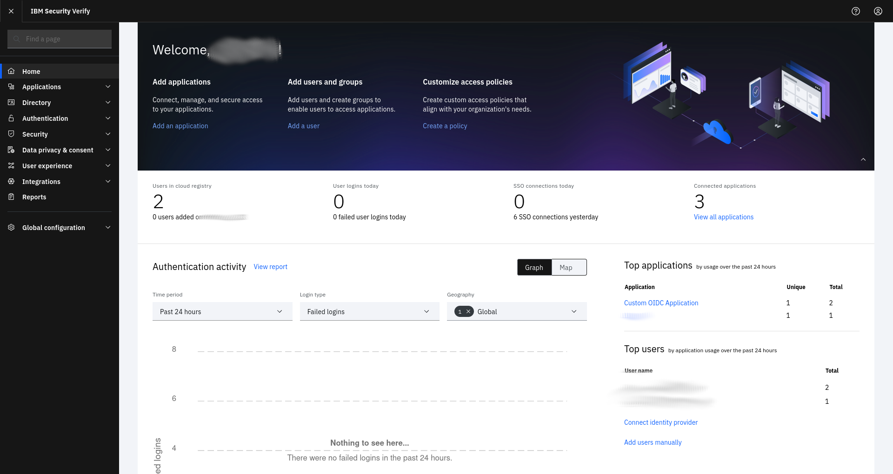

After logging in, on the left-hand menu, open Applications and click "Applications"

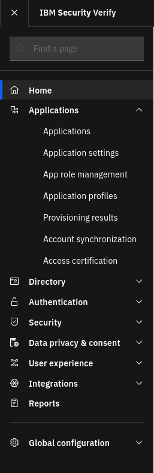

On the Applications Screen, select "Add Application" on the top right

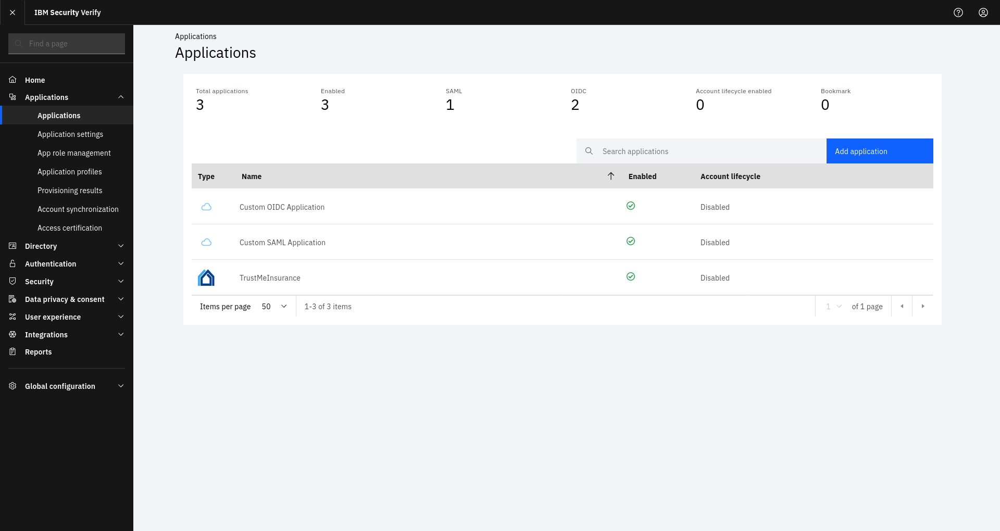

On the Application Creation screen, select "Cusstom Application" at the top, above the search bar

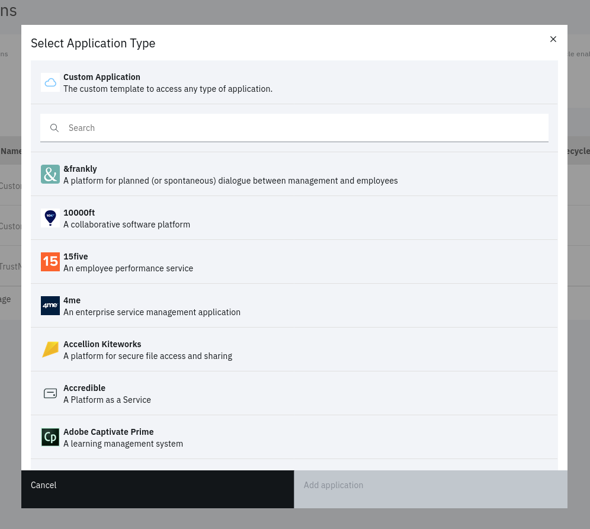

On the "General" tab of the custom app, add a company name and a custom app name if you wish.

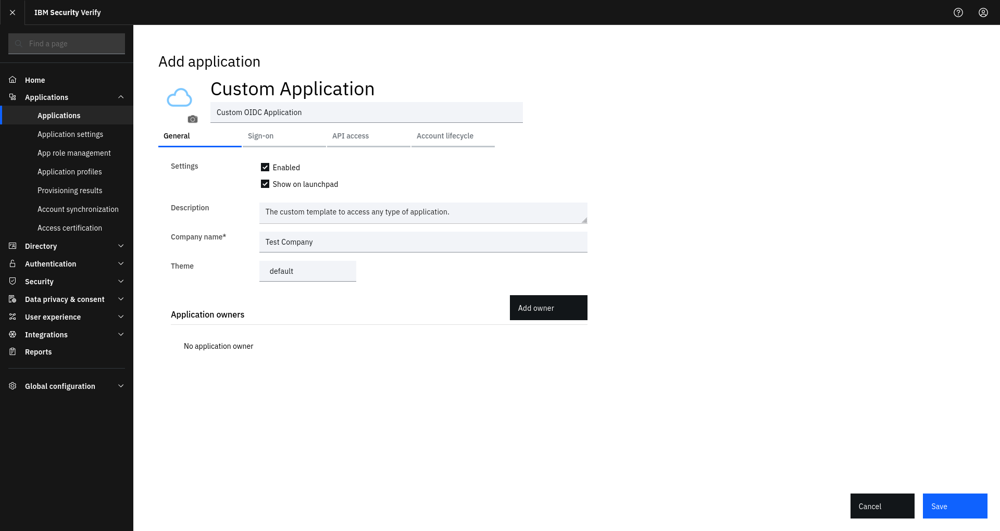

Next, go to the "Sign-On" tab. By default, the connector will be SAML, you will need to click the dropdown and select "Open ID Connect 1.0"

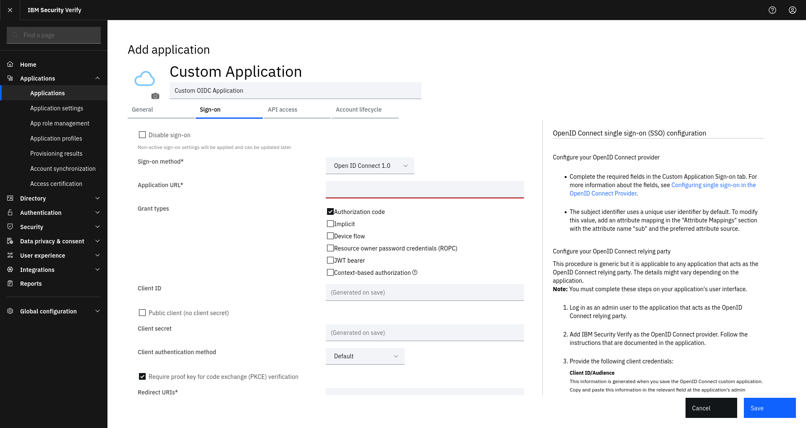

There are 3 more things you need to do on this page: 
    1. Set the Application URL to: https://localhost:3001
    2. DESELECT "Require proof key for code exchange (PKCE) verification"
    3. Set the Redirect URI to: https://localhost:3001/auth/redirect

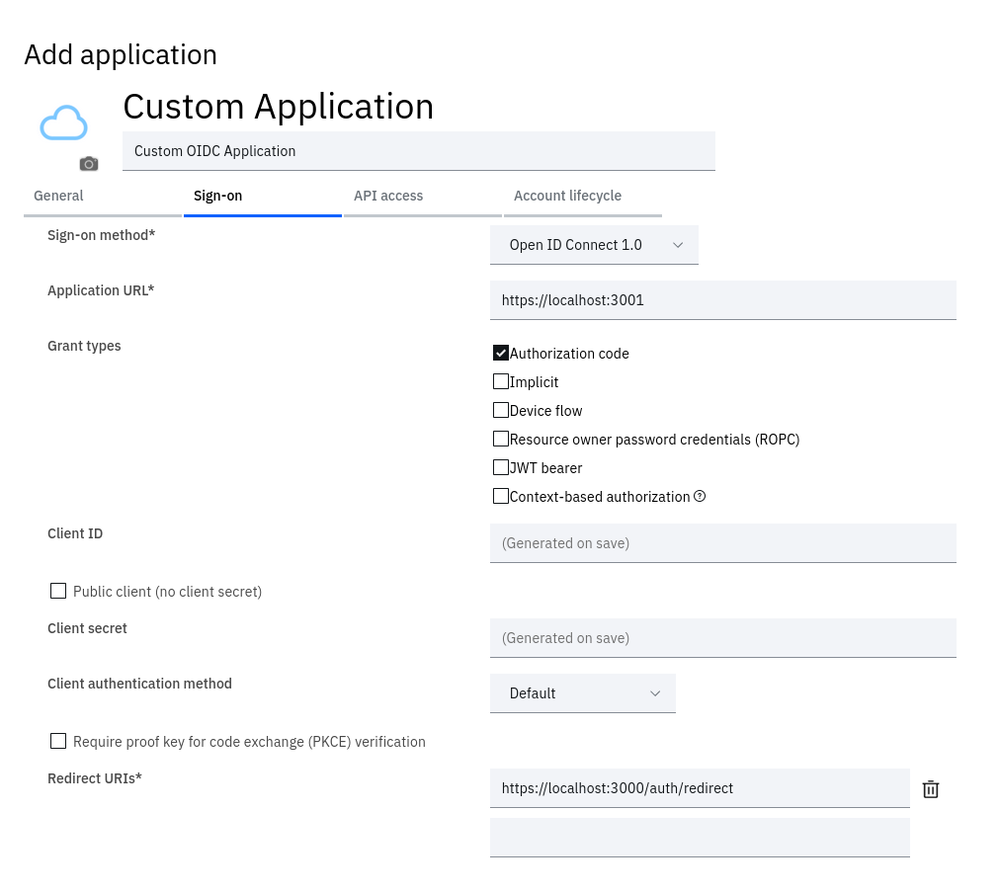

After that, save the application. Aafter it saves, back on the "Sign-On" tab, copy the Client ID, and Client Secret and paste them in the appropriate areas on the .env file.

**Note** Do not attempt to use this client and secret. The application was deleted immediately upon creation of this repo and your application will not work.

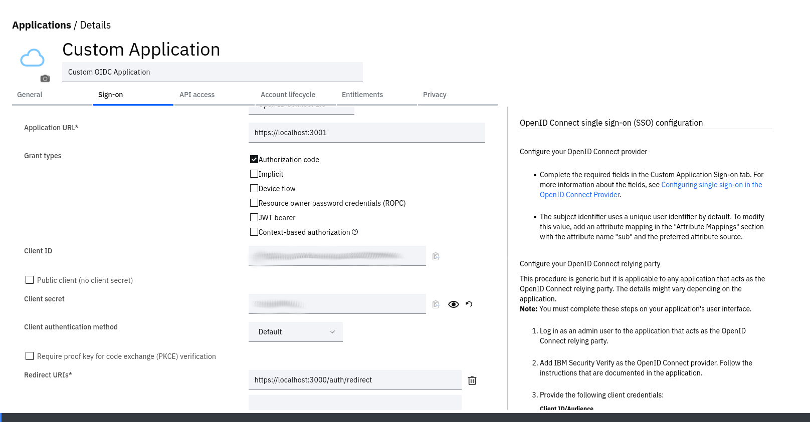

Finally, go over to the "Entitlements" tab and change the entitlements from "Select users..." (the default) to "Automatic Access for all users and groups"

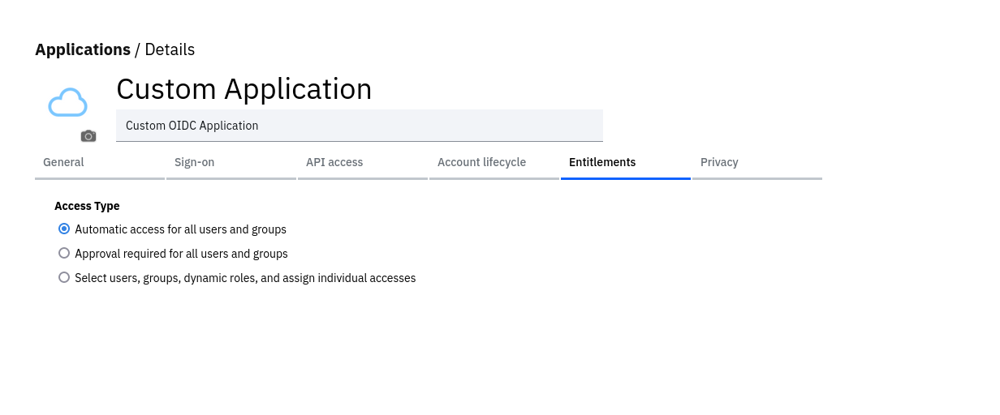

# DO NOT FORGET TO SAVE THE CONFIGURATION

## Login now

After saving the configuration, you'll be able to test the login flow. You can either:

    1 - From the client's webpage, replace the login button URL with https://localhost:3000
    2 - Go directly to https://localhost:3000 and kick off the workflow yourself.

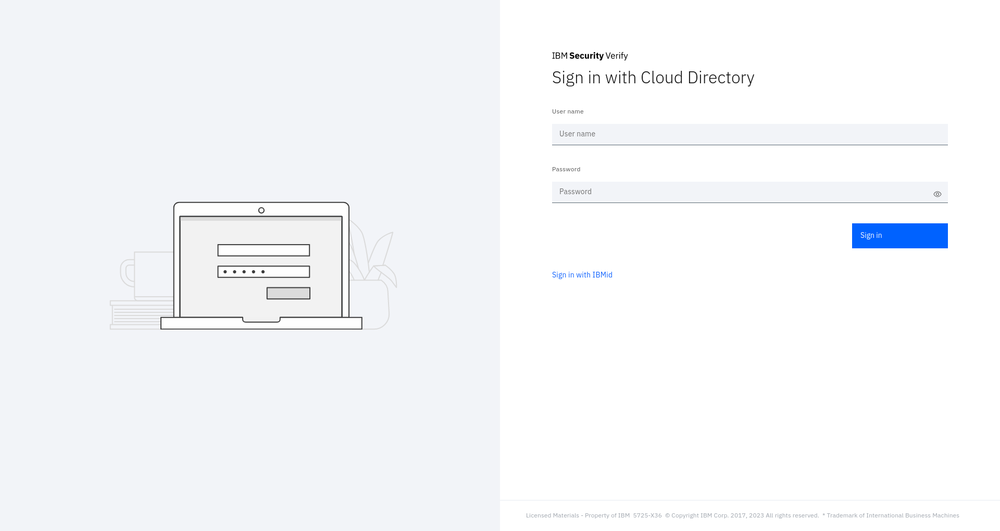

## View profile

Upon a successful login, you will now be able to see the attribute information for the user as well as their access token. You can also select the "Links" tab at the top of the page to show you links to setup documetation and other useful information about security Verify SaaS


